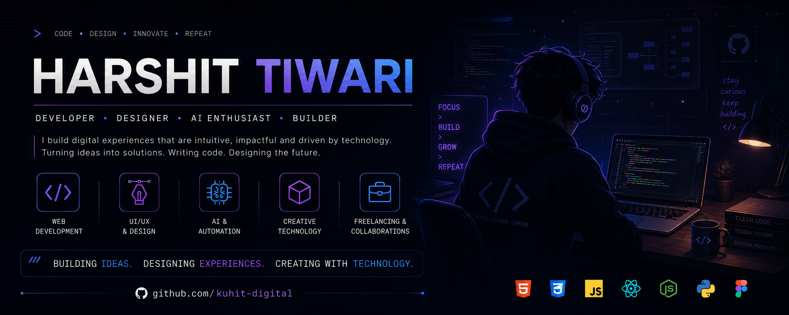

  

<h1 align="center">Harshit Tiwari</h1>

Building AI-powered products that solve real-world problems.

  Founder of <b>Kuhit Digitals</b> • Chrome Extension Developer • AI Explorer • Hackathon Builder

  
  &nbsp;
  
  &nbsp;
  
  &nbsp;
  
  

  

# 👨‍💻 About Me

I'm **Harshit Tiwari**, an aspiring developer from India and the founder of **Kuhit Digitals**.

I enjoy building practical web applications that solve real problems rather than just experimenting with code. My journey started with simple frontend projects and has gradually evolved into AI-powered applications and Chrome Extensions.

Currently, I'm focused on improving my skills in **Python**, **JavaScript**, and **SQL** while learning how to build scalable full-stack applications.

Outside coding, I actively participate in hackathons where I enjoy transforming ideas into working products and continuously challenging myself to learn something new.

# 🚀 Featured Project

## TabNest

**AI-powered Chrome Extension for managing browser workspaces using natural language.**

### Features

- 🤖 AI-powered commands
- 📂 Save and restore browser workspaces
- ⚡ Quick productivity workflow
- 🧠 Natural language support
- 🌐 Built using Chrome Extension APIs

**Tech Stack**

`JavaScript` • `Chrome APIs` • `Gemini AI`

🔗 **Repository**
https://github.com/kuhit-digitals/TabNest

**Tech Stack**

`JavaScript` `Chrome APIs` `Gemini AI`

➡️ Repository

https://github.com/kuhit-digitals/TabNest

---

# 📂 Projects

| Project | Description |
|----------|-------------|
| 🖱️ **VeloXSpeed** | CPS/SPS TESTER WEBSITE |
| 💻 **Frontend-Website-Series** | Frontend Websites for portfolio |
| 💡 **Hackathon-r2** | IntentFlow: AI powered planner software built while hackathon |
| 🗂️ **TabNest** | AI-powered Chrome Extension for browser workspace management |
| 💬 **SamvaadCord** | Discord-inspired communication platform |
| 🌊 **Naam Jap** | Interactive web application |
| 🎮 **Tic-Tac-Toe** | JavaScript game with custom gameplay logic |
| ✅ **To-Do List** | Productivity application with a modern UI |
| 🎨 **Preloader** | CSS loading animation collection |

---

# 🛠 Tech Stack

  

### Currently Learning

- 🐍 Python
- ⚡ JavaScript
- 🗄️ SQL
- 🌐 Backend Development

# 🏆 Journey

- 🌱 Started my journey by learning HTML and CSS.
- 💻 Built multiple frontend projects to strengthen my fundamentals.
- 🚀 Founded **Kuhit Digitals** to showcase my work and ideas.
- 🧩 Developed projects like **SamvaadCord**, **Naam Jap**, and **TabNest**.
- 🏆 Qualified for **NYC CodeQuest 2026 Round 2** as a solo participant.
- 🎯 Currently focused on AI-powered applications, Chrome Extensions, and Full Stack Development.

# 🎯 Current Goals

- 🚀 Build impactful AI-powered products
- 💻 Become a Full Stack Developer
- 🏆 Participate in more hackathons
- 🌍 Contribute to Open Source
- 📚 Continuously learn and improve
---

# 🤝 Let's Connect

---

> <b>"*_Build. Learn. Ship. Repeat._*"</b>

